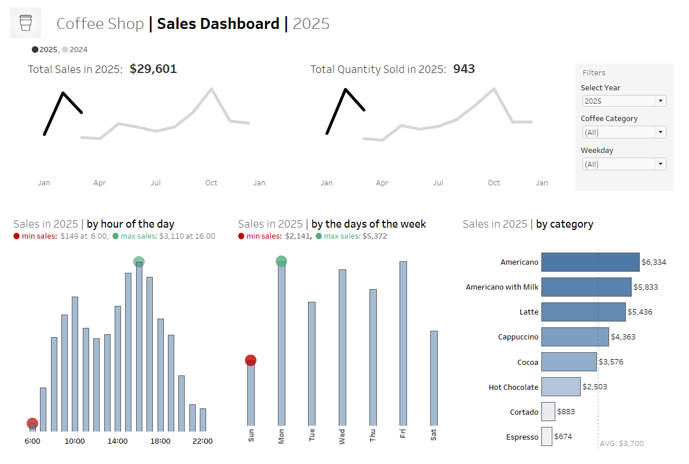

# Project List
*Welcome to my github. Below is a list of various SQL and Tableau projects.*

## Visualization (Tableau): Coffee Shop Sales Dashboard

- [Tableau Public Link](https://public.tableau.com/views/Coffeeshopdashboard_17579706182720/CoffeeDashboard?:language=en-US&:sid=&:redirect=auth&:display_count=n&:origin=viz_share_link)

    
    *[Data Source](https://www.kaggle.com/datasets/navjotkaushal/coffee-sales-dataset/data)*

- **Dashboard Objective**

    Presenting an overview for coffee sales: key metric trend charts and sales breakdown
    

- **Metrics**

1. KPI trend chart with year-to-year comparison: sales, # of coffee sold
2. Revenue breakdown
    1. Sales by hour of the day
    2. Sales by days of the week
    3. Sales by coffee category

## Visualization (Tableau): Store Customer Dashboard

- [Tableau Public Link](https://public.tableau.com/views/Sales_Dashboard_17576098897380/CustomerDashboard?:language=en-US&:sid=&:redirect=auth&:display_count=n&:origin=viz_share_link) - *Click “Customer” navigation button*
    
    *[Data Source & Training Content](https://www.blog.datawithbaraa.com/)*

- **Dashboard Objective**

    Providing an overview for customer metrics and stats

- **Metrics**

1. KPI trend chart + year-to-year comparison: customer number, sales per customer, order number
2. Customer order behavior: identify most common order number per customer for a given year
3. Profit & Loss by subcategory
4. Top customer stats: display sales, profit, order number from top customers for a given year

## Visualization (Tableau): Store Sales Dashboard

- [Tableau Public Link](https://public.tableau.com/views/Sales_Dashboard_17576098897380/CustomerDashboard?:language=en-US&:sid=&:redirect=auth&:display_count=n&:origin=viz_share_link)  - *Click “Sales” navigation button*
    
    *[Data Source & Training Content](https://www.blog.datawithbaraa.com/)*

- **Dashboard Objective**

    Providing a high level metrics for sales performance

- **Metrics**

1. KPI trend chart + year-to-year comparison: sales, profits, quantity sold
2. Composition of revenue: sales by subcategory (current year vs previous year)
3. Profit & Loss by subcategory
4. Sales & profit trend / seasonality:  weekly trend chart for current year

## SQL: E-Commerce Project

- [Project Link](https://github.com/feng-nmn-g/SQL-eCommerce)

- **Overview**

    This SQL project is to analyzes data from an e-Commerce business, such as customer segmentation by location, order pattern by day of the week, most popular item categories, etc.

- **Business questions explored**

1. Where are the customers distributed geographically? What are the cities / states that have the most customers?
2. Which days have the most order number? Are these related to holidays? How is the order number distributed across the different days of the week?
3. What are the most popular categories of items being ordered? 
4. What are the items that were delivered much later than the estimated delivery date?

## SQL: Restaurant Orders

- [Project Link](https://github.com/feng-nmn-g/SQL-Restaurant-Orders)

- **Overview**

    This SQL project explores a restaurant’s order data. The queries are used to understand the popular food items ordered, food category comparison, order size distribution, revenue contribution by menu items, etc.

- **Business questions explored**

1. From all the food items in the menu, what are the average prices and item number for each category?
2. What order size is the common for this restaurant? If we create 4 “buckets” for order size (i.e. 1, 2 – 5, 6 – 10, 11+ items per order), what are the order number for each “bucket”?
3. What are the most popular individual items?
4. What are some of the top revenue items (i.e. items with the most accumulative spending)?

## SQL: Vehicle Sales Data

- [Project Link](https://github.com/feng-nmn-g/SQL-Vehicle-Sales)

- **Overview**

    This SQL project is to analyze vehicle sales data, including sales metrics by state, by model / make. It also investigates how factors, such as condition and mileage, can affect sales.
    

- **Business questions explored**

1. Investigate geographical sales info: Which states have the most sales numbers? What are the average sales price for each state?
2. What are the most sold car models?
3. What’s the month-by-month sales trend?
4. For each vehicle body (i.e. sedan, SUV, hatchback, etc), what are the best selling model?
5. Is there a correlation between vehicle condition and sales price / number?
6. How does mileage affect average sales price and sales number?

## Tools

- **Database**: PostgreSQL, PgAdmin

- **SQL features / functions used** (but not limited to): subquery, group by, order by, case, window functions, join

- **IDE**: visual studio code